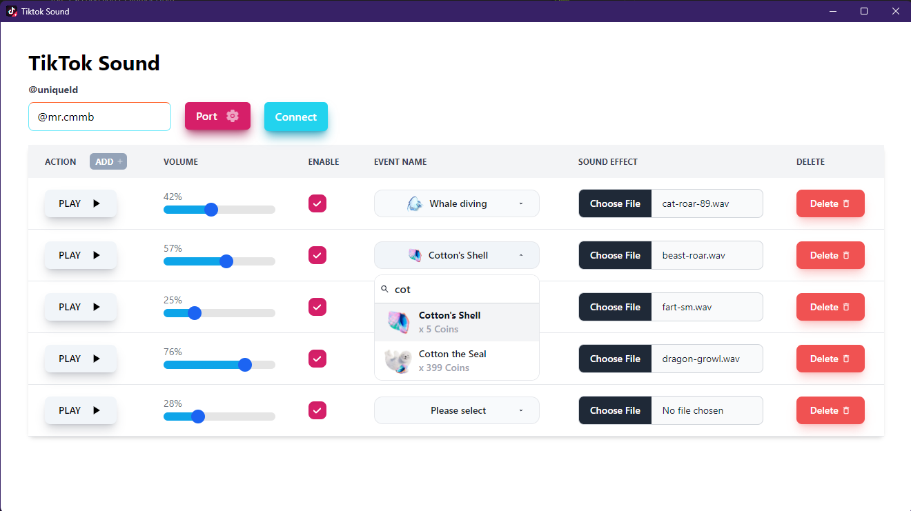

# TikTok Sound

TikTok Sound is an application use can easy connect to your live for create sound effects player url that can be used to overlay in Streaming Apps like OBS, TikTok Live, etc.

Please note: This application is during development. and I develop on free time please waiting for 3-6 months (might be over estimated) a first protrotype version might be available.

More Details: I have planed to make this app as open-source but still not add a license yet because I feel complicated on each license for now.

Todo List Roadmap
- Connect to live << **🚀 During development**
- Customize Overlay Popups
- etc.

Done List
- User Interface
- Add new event
- Delete existing event
- Browse sound files
- Select event from selection list
- Enable / Disable Sound Button
- Adjust sound volume levels
- Responsive to full screen
- Change event's sound
- Change event is existed
- Handler Play on file that does not existed
- Update State on `eventLists`
- Enable / Disable Sound State
- Change Port Feature

## Example Application Interfaces on lastest update

Latest - Snapshot <br/>
YouTube: https://www.youtube.com/watch?v=1Us7MHyj6No (previous version) <br/>
YouTube: _waiting for recording_ (current version)
<br />


## Installation

This application development on `Node=v20.5.0`. You can download node at https://nodejs.org/en.

_Install Dependency_

```bash
yarn install
```

_Start Application - Dev version_

```bash
yarn run start
```

**About windows installer**: Now, I have been facing with application doesn't work as expected. The React not loading on production version (If someone know how to fix it, you can pull request for fixing).

## Backend Application Features updates

- Get file location by path and parse to file type.

## Reference repositories

- https://github.com/isaackogan/TikTokWidgets
- https://github.com/zerodytrash/TikTok-Live-Connector

## Image source

I'm so apologize to creator if these images had been used without notice, I searched it on `free to share and use` image topic on bing search.

- Tiktok logo: https://www.pngall.com/tiktok-png/
