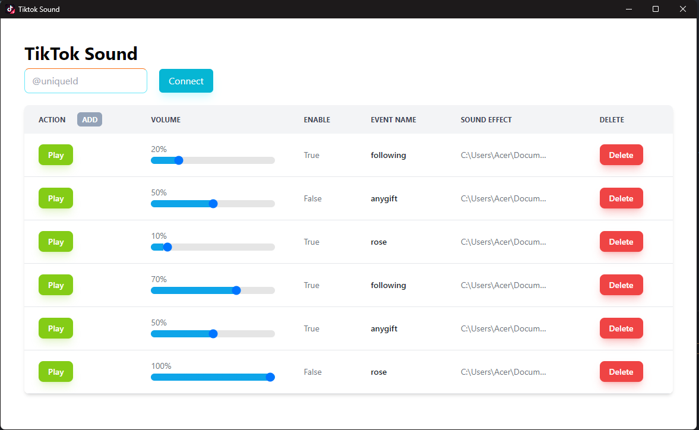

# TikTok Sound 
TikTok Sound is an application use can easy connect to your live for create sound effects player url that can be used to overlay in Streaming Apps like OBS, TikTok Live, etc.

Please note: This application is during development.

Todo List
- 🚀 User Interface
- Connect to live
- Change Port Feature
- Customize Overlay Popups
- Enable / Disable Sound
- Change event's sound
- Change event is existed
- etc.

Done List
- ✅ Create a new event
- ✅ Delete a existing event
- ✅ Control sound volume

## Example Application Interfaces on lastest update

## Prototype each UI element
### Delete and Add Event

### Enable Event CheckBox

### Select Event Handler

### Control Audio Volume

## Reference
- waiting ...

## Image source
I'm so apologize to creator if these images had been used without notice, I searched it on `free to share and use` image topic on bing search.
- Tiktok logo: https://www.pngall.com/tiktok-png/